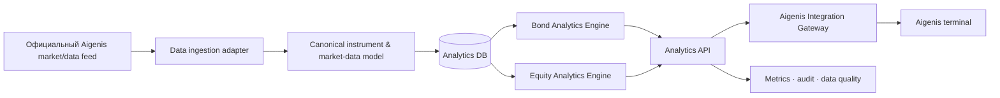

# Архитектурный и технический due-diligence отчёт

**Дата аудита:** 2026-08-06  
**Предмет:** текущая кодовая база `aigenis-parser` / Bonds Engine.  
**Цель:** оценить качество кода и архитектуры перед продажей Aigenis как аналитического модуля, а также принять решение по включению акций BCSE/MOEX.  
**Формат:** read-only аудит исходного кода, конфигурации, CI и локальных проверок. В ходе аудита код продукта не менялся.

---

## 1. Executive summary

### Итог

Кодовая база — это **сильный, функционально богатый модульный монолит**, а не одноразовый прототип. В ней есть раздельные доменные пакеты, FastAPI, PostgreSQL, миграции Alembic, Redis, мониторинг, data-quality проверки, партнёрское API, тесты, Docker и frontend. Это хороший фундамент для пилота Aigenis.

Однако покупатель будет оценивать не только количество функций. До технической проверки нужно закрыть несколько явных сигналов незавершённости:

1. Строгий Python lint сейчас не проходит: **7 замечаний Ruff**.
2. Type-check в CI помечен как **non-blocking**, то есть есть признанный type debt.
3. Frontend lint проходит с **7 предупреждениями**; отдельного frontend test suite нет.
4. `npm audit --omit=dev` сообщает о **3 high severity** у зависимостей (`postcss`, `react-router`/`react-router-dom`); результат нужно воспроизвести после обновления lockfile и закрыть.
5. В одном deployable смешаны B2C SaaS, биллинг, Telegram, SEO, scraping и будущая B2B-интеграция. Для Aigenis нужен ясный «интеграционный профиль» без лишнего контура.
6. Акции реализованы только как **MOEX market-data feature**, а не как полноценный аналитический продукт: нет BCSE source, нет equity score, нет тестов и, судя по вызовам, stock pipeline не включён в обычный scheduler/CLI flow.

### Решение по акциям

**Добавить акции в стратегию и в demo navigation — да. Добавлять их как полноценно обещанную функцию первой продажи — нет.**

Первый пилот стоит позиционировать так:

```text
Фаза 1: аналитика облигаций BCSE/MOEX — production scope.
Фаза 1.5: витрина акций / watchlist / рынок — demo или limited beta.
Фаза 2: отдельный Equity Analytics Engine после получения официального BCSE feed,
данных по корпоративным действиям и отдельной модели оценки.
```

Это правильнее, чем пытаться применить облигационный Score к акциям: метрики, горизонт, риски и экономический смысл у классов активов разные.

---

## 2. Масштаб и факты аудита

### 2.1. Кодовая база

| Зона | Файлов | Строк кода, приблизительно | Наблюдение |
|---|---:|---:|---|
| `api/` | 40 | 7 668 | FastAPI, auth, analytics, partner API, billing |
| `frontend/src/` | 63 | 10 953 | React SPA, dashboard, bonds, stocks, desk |
| `scraper/` | 47 | 6 339 | источники, pipeline, ORM, history |
| `scoring/` | 7 | 1 067 | bond risk/reward scoring |
| `portfolio/` | 9 | 1 276 | аллокация, P&L, rebalance, income |
| `desk/` | 11 | 1 392 | fixed-income analytics |
| `ml/` | 6 | 1 153 | features, registry, training, inference |
| `tests/` | 54 файлов | 6 750 | 384 тестовые функции по статическому подсчёту |

### 2.2. Выполненные проверки

| Проверка | Результат | Значение |
|---|---|---|
| `npm run build` | Успешно | Frontend собирается production-сборкой |
| `python -m ruff check ...` | Неуспешно: 7 findings | Нужно закрыть до due diligence |
| `npm run lint` | Exit 0, 7 warnings | Нужно превратить в 0 warnings |
| `npm audit --omit=dev --json` | 3 high findings | Нужен dependency remediation sprint |
| CI workflow | Есть | Python lint/test/migrations, frontend build/lint |
| mypy в CI | Non-blocking | Type safety ещё не gate |
| Frontend test runner | Не обнаружен | Нужны component/E2E tests |
| Stock test coverage | Не обнаружена | В `tests/` есть только SEO-упоминания `/stocks` |

### 2.3. Что в проекте уже хорошо

- Доменные границы в коде читаемы: `scraper`, `scoring`, `desk`, `portfolio`, `ml`, `notifications`, `api`.
- Async SQLAlchemy и PostgreSQL вместо локального файла/синхронного прототипа.
- Alembic migrations и отдельная CI-проверка upgrade/downgrade.
- Реализованы API security паттерны: JWT, feature gates, rate limiting, webhook HMAC, SSRF-проверки, CORS/CSP/security headers.
- В `scoring/data_quality.py` есть явная политика: критически плохие данные не должны получать Score.
- Есть observability: health endpoints, Prometheus/Grafana, Sentry integration, structured logging.
- Есть partner API с ключами, ограничением скорости и webhook lifecycle.
- Frontend уже использует lazy routes, production build и единый API client.
- Удалён service worker, который мог кешировать пользовательские API-ответы: это правильная security/privacy коррекция.

---

## 3. Целевая архитектура для Aigenis

### 3.1. Нынешняя модель

```text
Sources → Scraper → PostgreSQL → Analytics engines → FastAPI → React / Bot / Widget
```

Она удобна для собственного SaaS, но для Aigenis в ней есть лишние направления:

```text
SEO landing · self-service auth · billing · YooKassa · Telegram bot · referrals
```

### 3.2. Рекомендуемая модель поставки



### 3.3. Принцип разделения

| Контур | Что остаётся | Что не нужно включать в Aigenis production profile |
|---|---|---|
| Analytics Core | модели, scoring, data quality, desk, API schemas | лендинг, SEO, реферальная программа |
| Data Integration | официальный feed, mapping, backfill, freshness | browser scraping чужого терминала |
| Aigenis Gateway | SSO, entitlement, order deep links, audit | self-service email/password auth |
| Presentation | native UI/approved widget | собственный public signup/paywall |
| Operations | deploy, migrations, logs, SLO | Telegram/YooKassa, если не нужны Aigenis |

### 3.4. Почему не нужно сразу выделять микросервисы

Сейчас модульный монолит — разумный выбор. Микросервисы добавят:

- сетевые ошибки и трассировку;
- сложную локальную разработку;
- распределённые транзакции;
- больше инфраструктуры для маленькой команды.

Правильная цель на пилот — **модульный монолит с чёткими интерфейсами и раздельными deployment profiles**, а не преждевременное дробление сервисов.

---

## 4. Находки и план улучшений

### Приоритеты

- **P0** — блокирует безопасный pilot/production или серьёзно ухудшает due diligence.
- **P1** — важная инженерная работа до/во время пилота.
- **P2** — полезное усиление качества и масштабируемости.

### A-01 — Нет отдельного B2B deployment profile

**Приоритет:** P0  
**Наблюдение:** `docker-compose.yml` поднимает в одном продукте parser, API, frontend, bot, Postgres, Redis, Prometheus/Grafana, billing/auth конфигурацию и optional tunnels. Это правильно для самостоятельного SaaS, но перегружает историю продажи Aigenis.

**Риск:** CTO покупателя видит не «модуль аналитики», а платформу с чужой пользовательской аутентификацией, платежами и ботом, которые надо отключать/поддерживать.

**Решение:**

1. Ввести `DEPLOYMENT_PROFILE=aigenis`.
2. Создать `docker-compose.aigenis.yml`.
3. В profile оставить: `api`, `worker/scheduler`, `postgres`, `redis`, `monitoring` и, при необходимости, `analytics-ui`.
4. Исключить: публичный landing, email/password auth, YooKassa, Telegram bot, referral, public partner-key self-service.
5. Сформировать отдельный `.env.aigenis.example` без неиспользуемых секретов.
6. Описать ответственность по каждому сервису и минимальные ресурсы.

**Acceptance criteria:** чистый Aigenis stack запускается из одного compose профиля без платёжных/ботовых переменных и без публичного signup surface.

---

### A-02 — Data ownership и источник BCSE нужно архитектурно отделить

**Приоритет:** P0  
**Наблюдение:** источник Aigenis реализован в `scraper/sources/aigenis/`; в документации уже честно отмечено, что использование данных через собственную учётную запись — переходное решение.

**Риск:** для покупателя это главный due-diligence вопрос. Публичный MOEX ISS — отдельный источник; он не даёт права на BCSE/Aigenis data.

**Решение:**

1. Ввести интерфейс `MarketDataProvider` с официальными contract tests.
2. Написать `AigenisOfficialProvider`, когда будет предоставлен API/feed/export.
3. Перевести pipeline на provider через конфигурацию, а не через условные ветки по источнику.
4. Добавить `data_lineage` для каждого snapshot: источник, license/contract id, as-of, ingestion run, quality status.
5. На production profile запретить browser scraping fail-closed политикой.
6. Согласовать retention и право на хранение истории.

**Acceptance criteria:** каждая показанная бумага имеет `source`, `as_of`, `quality`; production Aigenis stack не стартует с неофициальным provider.

---

### A-03 — B2C и B2B auth необходимо разделить

**Приоритет:** P0  
**Наблюдение:** frontend хранит `access_token` и `refresh_token` в `localStorage`; текущий продукт имеет собственный email/password auth, Google OAuth и биллинг. Для Aigenis пользователь уже будет аутентифицирован в их терминале.

**Риск:** localStorage токены доступны при XSS; двойная авторизация испортит UX; внешний продукт не должен владеть учетными данными клиента Aigenis.

**Решение:**

1. Для Aigenis использовать SSO token exchange или BFF pattern.
2. Browser получает короткоживущую session cookie `HttpOnly; Secure; SameSite` либо обращается только в gateway Aigenis.
3. Gateway проверяет `iss`, `aud`, `exp`, `nbf`, `kid`, signature, scopes и tenant.
4. Analytics Core принимает сервисный identity/context, не пароль пользователя.
5. Создать отдельный entitlement adapter: `analytics:read`, `portfolio:read`, `alerts:write`.
6. Отключить public auth/billing routes в Aigenis profile.

**Acceptance criteria:** пользователь Aigenis открывает аналитику без второго логина; нет access/refresh token в localStorage Aigenis frontend.

---

### A-04 — API contract management нужно усилить

**Приоритет:** P0  
**Наблюдение:** есть `/api/v1/*`, но также отдельные root routes (`/auth`, `/billing`). Frontend вручную дублирует DTO в большом `frontend/src/lib/api.ts`.

**Риск:** backend и frontend расходятся; при интеграции Aigenis появляется третий клиент; breaking change заметят поздно.

**Решение:**

1. Зафиксировать отдельный namespace: `/api/aigenis/v1` или gateway contract.
2. Описать OpenAPI как контракт поставки, включая error schema, pagination, rate-limit headers и deprecation policy.
3. Генерировать TypeScript SDK из OpenAPI или проверять schemas через contract tests.
4. Убрать `unknown[]` и loose `Record` из ключевых response типов аналитики.
5. Ввести cursor pagination для больших списков.
6. Добавить `X-Request-Id`, `X-Data-As-Of`, `X-Model-Version`, `X-Data-Quality`.

**Acceptance criteria:** compatibility test проверяет все публичные ответы; контракт версионирован и не зависит от SPA.

---

### A-05 — Качество Python-кода не должно быть красным

**Приоритет:** P0  
**Факт:** Ruff сейчас завершает проверку с 7 findings:

- неиспользуемые `mkt_label` и `mkt_q` в `api/seo.py`;
- неиспользуемые аргументы в `scoring/data_quality.py` и `scoring/engine.py`;
- 2 упрощения условных веток;
- строковая type annotation, которую Ruff предлагает исправить.

**Риск:** это небольшой объём, но первый вопрос CTO будет: «почему CI допускает красный lint?»

**Решение:**

1. Исправить 7 findings без `--unsafe-fixes`.
2. Включить `ruff check .` как обязательный status check.
3. Добавить `ruff format --check .` в CI.
4. Добавить pre-commit hook или `make verify`.
5. После cleanup закрыть похожие предупреждения во frontend.

**Acceptance criteria:** Ruff 0 findings на чистом checkout.

---

### A-06 — Type safety пока признанным образом не гарантирована

**Приоритет:** P1  
**Факт:** mypy job в CI имеет `continue-on-error: true`; комментарий прямо говорит о существующем type debt.

**Риск:** type regressions не блокируют merge; особенно опасно на API, provider adapters, money/decimal и идентификаторах инструментов.

**Решение:**

1. Начать с «строгого острова»: `api/aigenis`, `scraper/providers`, `scoring`, `portfolio`.
2. Сделать mypy blocking для новых/изменяемых файлов в этих пакетах.
3. Не использовать `dict`/`object` на границе домена и API без Pydantic DTO.
4. Разделить `Money`, `Percent`, `InstrumentId`, `Market` через value types/aliases.
5. Поэтапно снять `continue-on-error` для core.

**Acceptance criteria:** mypy blocking для integration core; API DTO не содержат untyped payload на критическом пути.

---

### A-07 — Frontend трудно поддерживать как white-label UI

**Приоритет:** P1  
**Факты:**

- В `frontend/src` найдено 143 использования inline `style={{...}}`.
- `i18n.tsx` около 142 KB.
- `AppLayout.tsx`, `AnalyticsPage.tsx`, `BondsPage.tsx` совмещают layout, loading, domain transformation и view logic.
- Отдельный frontend test runner не настроен.

**Риск:** стили трудно переопределять под дизайн-систему Aigenis; регрессии интерфейса не ловятся; изменения становятся дорогими.

**Решение:**

1. Создать `frontend/src/features/analytics/` и `frontend/src/ui/`.
2. Ввести tokens-only styling: CSS variables / Tailwind tokens вместо inline брендовых hex на ключевых экранах.
3. Разделить container components и presentational components.
4. Перенести переводы по namespaces (`analytics.ts`, `stocks.ts`, `common.ts`).
5. Добавить TanStack Query или аналог для cache/retry/invalidation/loading state.
6. Добавить Vitest + React Testing Library + Playwright E2E.
7. Ввести Storybook или визуальный каталог компонентов для Aigenis theme/white-label review.

**Acceptance criteria:** demo/analytics UI не содержит hard-coded Aigenis colours вне theme tokens; есть component и E2E tests для основного flow.

---

### A-08 — Frontend lint warnings и dependency audit нужно закрыть

**Приоритет:** P0 для dependency review, P1 для lint warnings.  
**Факты:**

- `npm run lint` завершается успешно, но выдаёт 7 warnings: unused variables/catch params, unused expressions, missing `useMemo` dependency.
- `npm audit --omit=dev` сообщает 3 high severity findings: `postcss`, `react-router`, `react-router-dom`.

**Риск:** warning debt быстро растет; security report с high findings будет замечен покупателем.

**Решение:**

1. Исправить 7 warnings и включить lint policy без предупреждений для нового кода.
2. Проверить фактическое advisory range и lockfile: установлен `react-router-dom@7.18.2`, а audit output требует дополнительной ручной верификации version range.
3. Выполнить controlled upgrade/downgrade в отдельной ветке, `npm ci`, lint, build, E2E и повторный audit.
4. Обновить `postcss` через безопасное обновление lockfile.
5. Зафиксировать SBOM/зависимости и еженедельный Dependabot/Renovate policy.

**Acceptance criteria:** `npm audit --omit=dev` не содержит high/critical либо есть письменный, подтверждённый security exception с датой закрытия.

---

### A-09 — Тесты сильны для bonds, но неравномерны

**Приоритет:** P1  
**Факты:** 384 тестовые функции распределены по scoring, auth, billing, desk, security, APIs и bot. Для акций отдельные тесты не обнаружены; упоминания `/stocks` встречаются в SEO tests.

**Риск:** новая или существующая stock функциональность может выглядеть работающей в UI, но не иметь гарантии ingestion/history/API поведения.

**Решение:**

1. Добавить tests для stock parser, API, repository, history, pagination и sector aggregates.
2. Добавить fixtures с фактическими MOEX payload для TQBR/TQOD/TQDE.
3. Добавить contract tests для official BCSE provider после появления.
4. Добавить frontend E2E `trading → analytics → detail`.
5. Разделить быстрый unit suite и integration suite с PostgreSQL/Redis.
6. Публиковать coverage по пакетам, не только общий процент.

**Acceptance criteria:** bonds и stocks имеют симметричный минимальный набор parser/repository/API tests.

---

### A-10 — Stocks pipeline выглядит неполностью operationalized

**Приоритет:** P1  
**Факты:**

- `scraper/moex_stocks.py` реализует `MoexStockClient`.
- `scraper/pipeline.py` содержит `run_once_moex_stocks`.
- Есть `stocks` и `stock_history` таблицы, API и React pages.
- Поиск вызовов показывает pipeline function в основном только в собственном определении; не найдено подключения к обычному scheduler/CLI flow.

**Риск:** после деплоя stocks могут не обновляться автоматически; UI покажет устаревший или пустой набор.

**Решение:**

1. Явно добавить `stocks refresh` command и scheduler job.
2. Ввести `STOCK_DATA_SOURCE`, boards, refresh cadence, history depth, error budget.
3. Добавить freshness status по рынку/board.
4. Добавить database indexes для list/sort paths.
5. Добавить alert, если последняя stock ingest старше SLA.
6. Сделать stock ingestion отдельным worker job, чтобы он не задерживал bonds refresh.

**Acceptance criteria:** есть наблюдаемый scheduled stock run, timestamp свежести, тесты и fail-safe поведение.

---

### A-11 — Domain model привязан к облигациям

**Приоритет:** P1 при добавлении акций.  
**Наблюдение:** portfolio, alerts, scoring, recommendations и API используют `BondORM`/`internal_id` непосредственно. Stocks существуют параллельно, но не участвуют в общем risk/portfolio/instrument contract.

**Риск:** попытка «быстро добавить акции» приведёт к копированию bond API, alerts, positions, watchlist и recommendation logic, после чего продукт станет трудно поддерживать.

**Решение:**

1. Не переписывать всю БД сразу.
2. Ввести abstraction layer:

```python
InstrumentRef = {"asset_class": "bond" | "equity", "market": ..., "instrument_id": ...}
```

3. Создать read-model `InstrumentSummary` для общего search/watchlist/alerts UI.
4. Оставить class-specific analytics раздельными: `BondAnalytics`, `EquityAnalytics`.
5. Ввести asset-aware alert metrics (`price`, `yield`, `dividend`, `score`) с разрешённым списком по asset class.
6. Портфель переводить к general positions только после определения valuation/currency/FX policy.

**Acceptance criteria:** общий shell может отображать bonds и equities без ложного общего Score; доменные расчеты остаются типизированными по asset class.

---

### A-12 — Слишком крупные файлы и прямой доступ к ORM увеличивают стоимость изменений

**Приоритет:** P2  
**Примеры:** `api/seo.py` ~64 KB, `api/analytics.py` ~54 KB, `scraper/orm.py` ~44 KB, `i18n.tsx` ~142 KB, `LandingPage.tsx` ~34 KB.

**Риск:** merge conflicts, случайные регрессии, сложность code review, трудно тестировать бизнес-правила отдельно от HTTP/ORM.

**Решение:**

- разрезать routers по use case;
- вынести service/use-case layer;
- DTO/serializers отделить от ORM;
- modules `bonds`, `stocks`, `portfolio`, `identity`, `entitlements`, `reports`;
- вынести i18n dictionaries из TSX;
- установить size/complexity budget для новых файлов.

**Acceptance criteria:** новый Aigenis API не добавляется в `api/analytics.py` монолитно; бизнес-логику можно протестировать без HTTP.

---

### A-13 — Планировщик при горизонтальном масштабировании должен иметь лидерство

**Приоритет:** P1 до scale-out.  
**Наблюдение:** scheduler задачи существуют в parser контуре. При единственном parser container это просто. При двух репликах могут появиться duplicate ingestion, duplicate alerts и гонки.

**Решение:**

- держать ровно одну replica scheduler worker в пилоте;
- при scale-out добавить PostgreSQL advisory lock или Redis distributed lock;
- отделить stateless API replicas от worker/scheduler;
- сделать jobs idempotent и хранить job run history;
- добавить per-job timeout, retry, dead-letter/failed run observability.

**Acceptance criteria:** две API-реплики не создают два data refresh/alert delivery; dashboard показывает job owner/run id/outcome.

---

### A-14 — Redis production hardening

**Приоритет:** P2, P1 если Redis выходит за private network.  
**Наблюдение:** compose Redis внутренне не публикуется, что хорошо, но `redis-server` запускается без явно заданного `requirepass`; `.env.example` допускает парольный URL.

**Решение:**

- использовать Redis ACL/password через secrets;
- не публиковать порт наружу;
- TLS при внешнем/managed Redis;
- отдельные key prefixes/DB для cache, rate limit, queue/locks;
- задокументировать поведение при Redis outage (rate limit fail-open/fail-closed по каждому endpoint).

---

## 5. Акции: текущее состояние

### 5.1. Что уже есть

| Возможность | Состояние |
|---|---|
| MOEX shares ingestion | Есть: `scraper/moex_stocks.py` |
| Boards | TQBR, TQOD, TQDE |
| Stock ORM и history | Есть |
| Stock list API | Есть: `/api/v1/stocks` |
| Stock detail API | Есть |
| История/свечи | Есть |
| Sector aggregates | Есть |
| React StocksPage / StockPage | Есть |
| MOEX API доступ | Работает: проверен candles endpoint |
| BCSE stocks source | Не обнаружен |
| Equity score | Не обнаружен |
| Equity recommendations | Не обнаружены |
| Stock-specific tests | Не обнаружены |
| Регулярный stock scheduler wiring | Не обнаружен |

### 5.2. Что нельзя переносить от облигаций к акциям

| Bond metric | Почему нельзя копировать |
|---|---|
| YTM | У акции нет фиксированного погашения/доходности к погашению |
| Duration / convexity | Не применимы к equity |
| Купонный календарь | Дивиденды не гарантированы и имеют другую природу |
| Bond credit score | Не является equity valuation |
| Carry/rolldown | Другой финансовый смысл |
| Relative value по кривой | Для акций нужен иной peer/sector framework |

### 5.3. Правильный Equity Analytics Engine

Не делать единый `Score` без понятной семантики. Ввести equity-specific dimensions:

| Измерение | Примеры сигналов | Зависимость от данных |
|---|---|---|
| Liquidity | оборот, число сделок, bid-ask spread | market data |
| Valuation | P/E, P/B, EV/EBITDA, FCF yield | fundamentals |
| Dividend | yield, payout, history, stability | corporate actions/fundamentals |
| Quality | ROE, debt/EBITDA, margins, earnings stability | financial statements |
| Momentum | 1/3/6/12m return, relative strength | price history |
| Volatility/risk | realized volatility, max drawdown, beta | price history + benchmark |
| Event risk | reporting, dividends, SPO, corporate actions | event feed |

Результат должен быть не «Bond Score 84», а, например:

```text
Equity profile
  Liquidity: high
  Valuation: neutral
  Dividend profile: attractive
  Momentum: positive
  Risk: medium
```

Опционально можно агрегировать это в `Equity Opportunity Score`, но только после:

- документированной методологии;
- backtest;
- стабильности в разных рынках;
- прозрачных факторов;
- согласования compliance.

### 5.4. Вопрос BCSE

Для BCSE акций особенно важны:

- ограниченная ликвидность;
- неполнота/редкость сделок;
- корпоративные действия и дивидендные данные;
- маленький universe;
- качество отчётности и частота обновления;
- надёжный официальный data feed.

Поэтому первая ценность для BCSE акций — не «предсказывать цену», а:

1. единая карточка инструмента;
2. исторические цены/обороты;
3. корпоративные события;
4. дивидендная история;
5. сравнение с сектором;
6. риск ликвидности;
7. watchlist и алерты.

Это честнее и полезнее для клиента, чем агрессивный ML-score на малом наборе наблюдений.

---

## 6. Рекомендуемая продуктовая стратегия по акциям

### Вариант A — не добавлять акции в первую продажу

**Плюс:** самый чистый scope; сильная фиксированная доходность и готовый bond engine.  
**Минус:** Aigenis видит в терминале акции, поэтому может спросить, почему аналитика их игнорирует.

### Вариант B — добавить акции как «Market coverage / roadmap»

**Плюс:** демонстрирует широту платформы, не создавая невыполнимых обещаний.  
**Минус:** нужно чётко маркировать как Phase 2.

### Вариант C — добавить equity market view в демо

**Плюс:** лучше соответствует навигации Aigenis и показывает, что архитектура не привязана к одному классу активов.  
**Минус:** нельзя показывать акции рядом с облигациями как будто их аналитика одинаково зрелая.

### Рекомендация

Выбрать **B + ограниченно C**:

```text
Первый пилот: Bonds Analytics (production-grade).
В демо: вкладка «Акции» с market overview, карточкой, ликвидностью,
сектором, историей и watchlist — отмеченная как «расширение пилота».
В коммерческом предложении: Equity Analytics Phase 2 после data agreement.
```

На главном demo-экране аналитики добавить сегмент:

```text
[Облигации] [Акции]

Облигации: доступно в пилоте
Акции: Market Overview · расширение пилота
```

Не скрывать ограничение. Это повышает доверие технического и продуктового покупателя.

---

## 7. План реализации Equity Phase 2

### Шаг 1 — Discovery данных (1–2 недели)

- Получить перечень BCSE equities, identifiers и торговые поля.
- Согласовать официальный API/export и refresh SLA.
- Проверить доступность: OHLCV, trades, order book/spread, corporate actions, dividends, fundamentals.
- Зафиксировать license/retention/redistribution rights.
- Создать instrument mapping Aigenis ID ↔ ISIN ↔ ticker ↔ analytics ID.

### Шаг 2 — Operational market data (1–2 недели)

- Закончить provider adapter.
- Добавить scheduler и freshness monitoring.
- Протестировать parser/repository/API на fixture payloads.
- Реализовать data quality rules для equities.
- Добавить history completeness checks и late corporate action correction.

### Шаг 3 — Equity MVP (2–3 недели)

- List + filters: market, sector, liquidity, dividend.
- Detail: price, turnover, history, sector, basic ratios.
- Watchlist и alerts на price/volume/dividend event.
- Секторные comparison charts.
- Accessibility, localization, audit events.

### Шаг 4 — Аналитика и методология (3–6 недель)

- Определить factor taxonomy.
- Получить достаточную историю и benchmark policy.
- Построить baseline rules before ML.
- Backtest / walk-forward validation.
- Model registry, versioning, explainability.
- Compliance review copy and disclaimers.

### Шаг 5 — Production rollout

- Feature flag на employee/internal cohort.
- Мониторинг data drift/model quality.
- A/B измерение usage и переходов к заявке.
- Постепенный rollout Premium users.

---

## 8. Технический roadmap до due diligence

### Спринт 0 — clean bill of health (3–5 дней)

- [ ] Ruff: 0 findings.
- [ ] Frontend lint: 0 warnings.
- [ ] Dependency audit: 0 high/critical либо задокументированное исключение.
- [ ] Reproducible `make verify`/CI command.
- [ ] Production build и selected test suite в чистом environment.
- [ ] Обновить README: фактическое число тестов, текущие источники и profiles.
- [ ] Удалить/исправить stale docs, упоминающие несуществующие компоненты.

### Спринт 1 — Aigenis integration boundary (1–2 недели)

- [ ] Compose profile `aigenis`.
- [ ] SSO/gateway architecture decision record.
- [ ] OpenAPI contract for list/detail/portfolio impact/alerts.
- [ ] Instrument mapping table + reconciliation.
- [ ] Data lineage/freshness/quality metadata.
- [ ] Demo side-effect guard.
- [ ] Threat model: auth, iframe, data, order deep links, webhooks.

### Спринт 2 — demo quality (1–2 недели)

- [ ] DemoShell, fixtures, deterministic flow.
- [ ] Visual regression screenshots.
- [ ] E2E flow tests.
- [ ] Error/empty/stale data states.
- [ ] Secure demo deploy + fallback recording.

### Спринт 3 — stock foundation (после решения Aigenis)

- [ ] Явный stock CLI/scheduler wiring.
- [ ] Stock tests.
- [ ] Freshness metrics.
- [ ] Official BCSE stock provider discovery.
- [ ] Equity MVP only; не обещать score до methodology/backtest.

---

## 9. Вопросы, которые нужно задать Aigenis до оценки сроков

1. Какой официальный feed/API доступен для BCSE bonds и stocks?
2. Кто владеет instrument master и каким ID надо доверять?
3. Есть ли sandbox/staging терминала и SSO issuer?
4. Где должен жить сервис: их VPC, on-premise, облако, managed environment?
5. Какие требования к локализации данных, retention и доступу подрядчика?
6. Какие уровни Premium/entitlements существуют сейчас?
7. Кто владеет disclaimer/compliance approval?
8. Какие каналы уведомлений разрешены: push, email, SMS, in-app?
9. Какой order-creation deep link/API доступен и какие поля разрешено предзаполнять?
10. Какие product KPI важнее: conversion, retention, turnover, manager productivity?
11. Какие классы активов реально входят в первые 6 месяцев: bonds, shares, funds, FX?
12. Какие рынки и валюты критичны в первую очередь?

---

## 10. Финальный вердикт

Проект имеет **хорошее инженерное ядро для продажи**. Его не нужно переписывать ради «идеальной архитектуры». Нужны две последовательные работы:

1. Сначала убрать легко проверяемые признаки долга: lint, dependency audit, frontend tests, документация, operational wiring акций.
2. Затем упаковать существующий модульный монолит в понятный Aigenis integration profile: официальный data feed, SSO/gateway, contract API, инструментный mapping, observability и ограниченный pilot scope.

Акции следует добавить в дорожную карту и в ограниченную витрину демо, но не смешивать с готовой облигационной аналитикой. Правильная позиция перед Aigenis:

> Для облигаций мы готовы дать объяснимый аналитический модуль в пилоте. Для акций уже есть рыночная инфраструктура MOEX, а BCSE Equity Analytics мы запускаем отдельной фазой на вашем официальном data feed и с собственной, проверяемой методологией.

