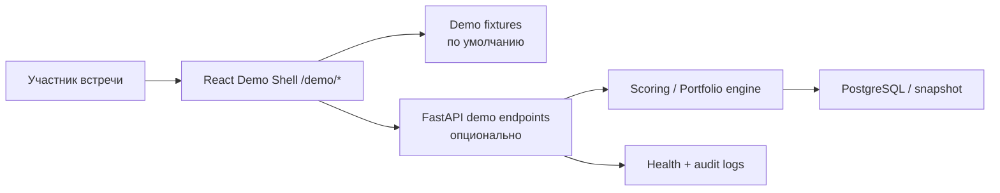
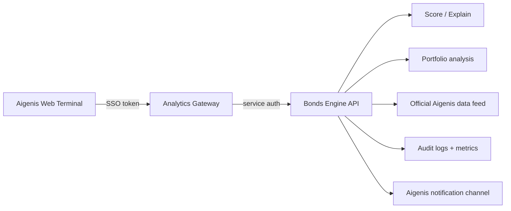

# Final plan: аналитический модуль для Aigenis Invest

**Статус:** рабочий план для подготовки продающего демо, пилота и production-интеграции.  
**Цель:** продать Aigenis не отдельный сервис Bonds Engine, а B2B-модуль аналитики, который увеличивает ценность их терминала и Premium-предложения.  
**Главный принцип:** пользователь Aigenis не должен «уходить в другой продукт». Аналитика должна ощущаться нативной частью его привычного сценария: _рынок → отбор бумаги → объяснение → решение → заявка/алерт_.

---

## 1. Что именно продаём

### 1.1. Не продаём

- «AI» как самоцель;
- набор несвязанных экранов, ML-моделей и графиков;
- парсер данных Aigenis;
- обещание доходности, автоматические советы «купить» или торгового робота;
- ещё одну внешнюю подписку для клиента Aigenis.

### 1.2. Продаём

**Analytics Layer for Aigenis Invest** — слой, который превращает уже имеющиеся в терминале котировки и характеристики бумаг в понятный и объяснимый процесс отбора.

Ценность для Aigenis:

1. Пользователь быстрее понимает, какие облигации заслуживают внимания.
2. Premium-подписка получает измеримую функциональную причину для покупки и продления.
3. Клиенты чаще возвращаются в терминал благодаря алертам и watchlist-сценариям.
4. Менеджеры получают единый объяснимый язык для разговора о риске и доходности.
5. Aigenis получает аналитику поведения: какие бумаги анализируют, какие фильтры используют, где пользователь переходит к заявке.

### 1.3. Одна фраза для встречи

> Мы не меняем торговый терминал. Мы добавляем в него аналитический слой, который помогает клиенту быстрее перейти от списка бумаг к обоснованному следующему действию.

---

## 2. Итоговая рекомендация по демо

### Решение

Сделать отдельный, защищённый **integration preview**: интерактивную демонстрационную среду, которая воспроизводит ключевой рабочий контекст терминала и показывает в нём новый раздел «Аналитика».

Это **не должен быть** клон `web.aigenis.by`, прокси настоящего сайта или продукт, выдаваемый за уже официальный сервис Aigenis.

### Почему это лучший вариант

| Подход | Впечатление на встрече | Технический риск | Юридический/репутационный риск | Вердикт |
|---|---:|---:|---:|---|
| Показать существующий Bonds Engine | Среднее | Низкий | Низкий | Слабая продажа: это выглядит как отдельный сервис |
| Встроить текущий iframe в страницу | Среднее | Низкий | Средний | Подходит только как быстрый proof-of-concept |
| Создать concept demo в контексте терминала | Высокое | Средний | Низкий/средний | **Рекомендовано до согласия** |
| Создать branded preview после разрешения Aigenis | Очень высокое | Средний | Низкий после согласия | **Целевой вариант для второй встречи** |
| Скопировать сайт 1:1 и опубликовать | Высокое краткосрочно | Высокий | Высокий | Не делать |
| Встроить код в боевой `web.aigenis.by` без доступа | Неприменимо | Очень высокий | Очень высокий | Не делать |

---

## 3. Юридические и брендовые границы

> Этот раздел — практическая оценка рисков, а не юридическое заключение. До публичного branded-демо и тем более пилота нужен короткий review белорусского IP/IT-юриста.

В Беларуси использование товарного знака в интернете без разрешения и действия, способные вызвать смешение услуг/компаний, могут создавать риск. Законодательство также охраняет объекты авторского права. См. [закон о товарных знаках](https://www.wipo.int/wipolex/ru/legislation/details/22312), [закон о конкуренции](https://www.wipo.int/wipolex/ru/legislation/details/14969) и [закон об авторском праве](https://www.wipo.int/wipolex/ru/legislation/details/22302).

### 3.1. Что допустимо в concept demo

- Использовать собственный React-код, собственные иконки и собственные данные.
- Воспроизвести рабочую логику: боковая навигация, переключатель биржи, таблица, карточка инструмента, алерт.
- Использовать похожее спокойное fintech-направление, но не копировать все визуальные детали буквально.
- Написать: «Концепт интеграции аналитического модуля для Aigenis Invest».
- Показать демо на личной встрече или по защищённой ссылке конкретным сотрудникам.
- Использовать вымышленные имя, баланс и портфель пользователя.

### 3.2. Что нельзя делать без разрешения

- Использовать оригинальный логотип, иконки, CSS, HTML, иллюстрации или скриншоты как части интерфейса.
- Копировать терминал пиксель-в-пиксель.
- Использовать домен/поддомен с `aigenis` в названии.
- Называть демо «официальным Aigenis», «новой функцией Aigenis» или создавать видимость доступа к реальному аккаунту.
- Проксировать, скрейпить в реальном времени или внедрять скрипт в `web.aigenis.by`.
- Использовать реальные личные данные, портфели, заявки, логины или историю операций.
- Делать доступ по открытой публичной ссылке, доступной поисковикам.

### 3.3. Простой путь к branded preview

До публикации близкой к бренду версии получить письменное согласие. Достаточно письма/сообщения формата:

> Мы подготовили некоммерческий интерактивный прототип того, как аналитический модуль мог бы выглядеть в вашем терминале. Разрешаете ли вы использовать фирменное наименование и визуальные ориентиры Aigenis исключительно в закрытой демонстрационной среде для вашей команды? Демо не будет публично размещаться, не использует данные клиентов и не позиционируется как официальный доступный пользователям продукт.

Это разрешение не заменяет договор на production-интеграцию, но делает демонстрацию существенно безопаснее.

### 3.4. Маркировка демо

Внизу каждой demo-страницы:

```text
Концепт пилотной интеграции для Aigenis Invest · Демонстрационная среда
Не является торговой системой и не содержит персональных данных клиентов.
```

В branded preview после разрешения:

```text
Aigenis Invest Analytics Preview · Demonstration environment
```

Маркировка должна быть заметна, но не мешать основному впечатлению.

---

## 4. Границы первой версии

### 4.1. Что показываем

Только один связный сценарий:

```text
Торги → Аналитика → Фильтр рынка → Карточка облигации →
Влияние на портфель → Алерт / Переход к созданию заявки
```

Три экрана обязательны:

1. **Контекст терминала / Торги** — знакомая для Aigenis среда.
2. **Аналитика облигаций** — отбор, фильтры, Score и статусы.
3. **Карточка бумаги** — объяснение оценки и следующее действие.

Четвёртый экран желателен:

4. **Влияние на портфель** — единственный сильный «вау»-момент.

### 4.2. Что сознательно не включаем в продающее демо

- Внешний лендинг Bonds Engine.
- Регистрацию, биллинг, Telegram, реальную оплату.
- Все 20+ существующих разделов продукта.
- AI-чат, если он нестабилен или требует внешнего LLM-провайдера.
- Генерацию отчёта, если PDF не выглядит безупречно.
- Реальное создание заявки и реальный ребаланс.
- Непроверенные прогнозы и «автоматические рекомендации купить».

### 4.3. Почему ограничение важно

Чем больше экранов, тем выше вероятность, что на встрече увидят:

- другой брендинг;
- пустую страницу;
- неготовую локализацию;
- модель, которую невозможно объяснить;
- платёжный экран, не имеющий отношения к сделке с Aigenis;
- техническую ошибку вместо ценности.

Первое демо должно продавать **не ширину функциональности, а цельность сценария**.

---

## 5. UX и сценарий встречи

### 5.1. Роли в аудитории

| Роль | Что ей показать | Чего не перегружать |
|---|---|---|
| CEO / коммерческий руководитель | Premium-ценность, retention, воронка к заявке | Формулы и инфраструктура |
| Product owner | Пользовательский поток, сегменты и метрики | Внутренности ML |
| CTO / архитектор | API, SSO, безопасность, data ownership | Маркетинговые обещания |
| Риск / compliance | Explainability, disclaimer, audit trail | Термины «гарантированная доходность» |
| Менеджер / брокер | Быстрый ответ «что стоит изучить» | Сложные risk-модели |

### 5.2. Сценарий на 4–5 минут

1. **0:00–0:30 — контекст.** Открыть `/demo/trading`.

   Фраза: «Торговый терминал уже показывает рынок. Следующий вопрос клиента — на какие бумаги смотреть в первую очередь».

2. **0:30–1:15 — переход в аналитику.** Нажать «Аналитика» в боковом меню. Экран меняется без внешней вкладки, логина или чужого бренда.

   Фраза: «Это не отдельный сервис. Это следующий раздел терминала».

3. **1:15–2:15 — отбор.** Выбрать BCSE или MOEX, срок 1–3 года, сортировку по Score. Показать несколько бумаг с разными статусами.

   Фраза: «За несколько секунд клиент превращает длинный список в короткий список для дальнейшего анализа».

4. **2:15–3:30 — объяснение.** Открыть заранее выбранную облигацию. Показать факторы, а не магический показатель.

   Фраза: «Скор не заменяет решение, а объясняет, почему бумага попала в фокус».

5. **3:30–4:30 — действие.** Открыть влияние на портфель или создать алерт.

   Фраза: «Ценность появляется не в таблице, а в следующем действии пользователя — он сохраняет идею, получает сигнал или переходит к заявке».

6. **4:30–5:00 — продажа пилота.**

   Фраза: «Первый пилот — это 3 экрана и интеграция с вашим источником данных. Без изменения торгового ядра».

### 5.3. Демо-персона

Использовать один вымышленный профиль:

```text
Марина К. · Частный инвестор · Демо-среда
Портфель: 50 000 BYN
Цель: регулярный доход при умеренном риске
```

Не использовать реальные ФИО, номера договоров, остатки, снимки клиентских счетов или реальные уведомления.

---

## 6. Информационная архитектура demo-shell

### 6.1. Маршруты

Новые маршруты не должны конфликтовать с обычным продуктом.

```text
/demo                         → redirect /demo/trading
/demo/trading                 → DemoTradingPage
/demo/analytics               → DemoAnalyticsPage
/demo/analytics/bonds/:id     → DemoBondDetailPage или drawer
/demo/portfolio-impact/:id    → DemoPortfolioImpactPage или modal
/demo/alerts                  → DemoAlertConfirmationPage
```

В production планируется другой неймспейс, например `/analytics`, который согласует Aigenis. Демо не должно закреплять публичный production URL.

### 6.2. Структура компонентов

```text
frontend/src/demo/
├── DemoApp.tsx
├── DemoShell.tsx
├── demo-config.ts
├── demo-fixtures.ts
├── demo-api.ts
├── types.ts
├── components/
│   ├── DemoSidebar.tsx
│   ├── DemoTopBar.tsx
│   ├── DemoStatusBanner.tsx
│   ├── DemoWatermark.tsx
│   ├── MarketTable.tsx
│   ├── AnalyticsKpiStrip.tsx
│   ├── AnalyticsFilters.tsx
│   ├── BondScoreBadge.tsx
│   ├── BondDetailDrawer.tsx
│   ├── ScoreExplanation.tsx
│   ├── PortfolioImpactCard.tsx
│   └── DemoDisclaimer.tsx
└── pages/
    ├── DemoTradingPage.tsx
    ├── DemoAnalyticsPage.tsx
    └── DemoPortfolioImpactPage.tsx
```

### 6.3. Почему не использовать текущий `AppLayout` напрямую

Существующий [AppLayout.tsx](frontend/src/layouts/AppLayout.tsx) содержит логику обычного продукта: свободные/премиальные тарифы, многочисленные разделы, языки, AI-чат и профиль. Он полезен как источник стилей и паттернов, но прямое переиспользование приведёт к тому, что в демо попадут ненужные элементы, нарушающие иллюзию нативного модуля.

`DemoShell` должен быть отдельным и намеренно маленьким.

### 6.4. Feature flags

```ts
export const DEMO_CONFIG = {
  mode: 'concept' as 'concept' | 'approved',
  useFixtures: true,
  enableLiveRefresh: false,
  enableRequestCreation: false,
  enableExternalLinks: false,
  showBrandMark: false,
  showDemoWatermark: true,
};
```

Это даст два преимущества:

1. Concept-версия не сможет случайно показывать чужой бренд или боевую интеграцию.
2. После согласования изменяется конфигурация и ассеты, а не вся архитектура.

---

## 7. Визуальная система

### 7.1. Что уже есть в репозитории

- [aigenis-theme.css](frontend/src/aigenis-theme.css) — токены цветов, шрифтов, теней, радиусов и базовые компоненты;
- [index.css](frontend/src/index.css) — существующие брендовые переменные;
- [WidgetPage.tsx](frontend/src/WidgetPage.tsx) и [be-widget-core.js](frontend/public/be-widget-core.js) — готовые паттерны виджета и работы со скором.

### 7.2. Как использовать тему корректно

Для concept mode:

- использовать близкую палитру как общую стилистическую гипотезу, но не копировать брендовые ассеты;
- основной оттенок можно сделать чуть отличающимся от `#004b65`, например `#0B526B`;
- назвать CSS-переменные нейтрально: `--demo-brand-*`, а не `--aigenis-*`;
- использовать Lucide-иконки и системные/лицензированные шрифты;
- не переносить логотип, изображение буквы/знака и магазинные бейджи.

Для approved mode:

- использовать утверждённые ассеты, если Aigenis их предоставит;
- сохранять исходные цвета/шрифты/токены только в границах закрытого preview;
- фиксировать версию дизайн-пакета и согласование изменений.

### 7.3. Визуальные правила

- Основной фон: почти белый, без тяжёлых градиентов.
- Таблицы: высокая плотность, но читабельные строки 56–64 px.
- Числа: tabular numerals; единый формат `14,25%`, `2,4 года`, `50 000 BYN`.
- Статусы: не использовать только цвет — добавить текст и иконку.
- Score: 0–100 не должен выглядеть как гарантия или рейтинг кредитного агентства.
- Кнопки: только одно primary-действие на экран.
- Анимации: 150–200 ms, без пульсаций и «крипто»-эффектов.
- Адаптивность: демо минимум для 1366×768, 1440×900 и iPad; мобильный режим вторичен, но не должен ломаться.

---

## 8. Экран 1: «Торги» как входной контекст

### 8.1. Состав экрана

```text
┌────────────┬────────────────────────────────────────────────────┐
│ Левое меню │ Верхняя панель: BCSE / MOEX · уведомления · баланс │
│            ├────────────────────────────────────────────────────┤
│ Торги      │ Информационный баннер о режиме торгов               │
│ Портфель   ├────────────────────────────────────────────────────┤
│ Аналитика  │ Акции / Облигации                                   │
│ Справочник │ Результаты прошедших торгов                         │
│ Профиль    │ Таблица инструментов                                │
└────────────┴────────────────────────────────────────────────────┘
```

### 8.2. Требования

- Новый пункт «Аналитика» расположен там, где его ожидают увидеть по скриншоту терминала.
- У пункта небольшой бейдж `Новое`, который привлекает внимание, но не выглядит рекламой.
- Экран «Торги» должен быть рабочим: смена BCSE/MOEX меняет строки таблицы и валюту.
- Клик «Аналитика» сохраняет выбранную биржу в query parameter или state.

```text
/demo/trading?market=BCSE
  → /demo/analytics?market=BCSE
```

### 8.3. Подводные камни

- Не повторять реальную дату торгов или актуальный баланс, если это не проверенные данные.
- Не копировать логотипы эмитентов из терминала без проверки прав; в первом демо использовать текстовые или собственные нейтральные знаки.
- Не позволять пользователю «создать заявку» на этом экране: это вызывает ожидание реальной операции.
- Не делать «Торги» сложнее аналитики: это только контекст, а не главная часть встречи.

---

## 9. Экран 2: «Аналитика облигаций»

### 9.1. Цель экрана

Дать ответ на вопрос: «Из длинного списка облигаций, какие стоит изучить первыми и почему?»

### 9.2. Структура

```text
Заголовок: Аналитика облигаций
Подзаголовок: Сравнение доходности, риска и ликвидности в одном месте

KPI strip:
  5 привлекательных идей | 12 бумаг требуют проверки |
  14,2% лучшая риск-скорректированная доходность | обновлено 09:42

Фильтры:
  Рынок | Валюта | Срок | Риск | Ликвидность | Сбросить

Таблица:
  Бумага | Score | Статус | YTM | Погашение | Дюрация | Ликвидность | Открыть
```

### 9.3. Фильтры первой версии

| Фильтр | Значения | Поведение |
|---|---|---|
| Рынок | BCSE, MOEX | Получает значение из верхнего переключателя |
| Валюта | BYN, RUB, USD, EUR | Мультиселект не нужен: достаточно одного выбора |
| Срок | до 1 года, 1–3, 3–5, 5+ | Выражается через maturity date |
| Статус | привлекательна, нейтральна, требует проверки | Не называть «покупать/продавать» |
| Ликвидность | высокая, средняя, низкая | Помогает объяснить риск исполнения |

### 9.4. Score и статусы

Вместо абсолютного «рейтинга качества» Score должен быть **моделью приоритизации для анализа**.

| Диапазон | Визуальный статус | Допустимая формулировка |
|---:|---|---|
| 75–100 | Привлекательна | Стоит изучить в первую очередь |
| 55–74 | Нейтральна | Требует сравнения с альтернативами |
| 35–54 | Требует проверки | Есть значимые компромиссы |
| 0–34 | Повышенный риск | Необходима дополнительная проверка |
| Нет данных | Недостаточно данных | Автоматическое решение не принимается |

Никогда не использовать в карточке или экспортируемом тексте «гарантированно выгодна», «лучшая инвестиция», «безопасна», «обязательно купить».

### 9.5. Состояния интерфейса

Нужно реализовать и визуально проверить все состояния:

- loading skeleton;
- пустой результат по фильтрам;
- частично устаревшие данные;
- отсутствие Score из-за data quality;
- ошибка источника;
- отключённый live refresh;
- маленькая ширина таблицы;
- длинное название эмитента;
- нулевая/отсутствующая доходность;
- разные валюты и форматы округления.

---

## 10. Экран 3: карточка облигации

### 10.1. UX-решение

Для демо лучше **side drawer**, а не переход на большую отдельную страницу: участник встречи сохраняет контекст списка и понимает, что карточка — часть терминала.

### 10.2. Содержание drawer

```text
Название облигации
ISIN · Эмитент · Валюта · Срок до погашения

Score 84 / 100
Привлекательна для дальнейшего анализа

Почему бумага в фокусе:
  + доходность выше сопоставимых выпусков
  + комфортная дюрация
  + достаточная ликвидность
  − необходимо учитывать кредитный риск эмитента

Ключевые показатели:
  YTM · Купон · Цена · Дюрация · Оборот · Погашение

[Оценить влияние на портфель] [Создать алерт]
[Перейти к созданию заявки]

Дисклеймер
```

### 10.3. Explainability

Показывать максимум 4–6 факторов. Внутренние наименования `duration_component`, `volatility_component`, коэффициенты и весовые формулы скрывать.

Техническая логика может опираться на существующий `scoring/explain.py`, но frontend получает уже подготовленную модель представления:

```ts
type ExplanationFactor = {
  label: string;
  direction: 'positive' | 'negative' | 'neutral';
  plainText: string;
  importance: 'high' | 'medium' | 'low';
};
```

### 10.4. Правило для ML

ML-сигнал в первом демо должен быть вторичным:

```text
Модельный сигнал: нейтральный
Уровень уверенности: средний
Используйте вместе с параметрами выпуска и собственной оценкой риска.
```

Если confidence/качество модели нельзя уверенно защитить перед risk/compliance, не показывать ML в первой демонстрации вовсе.

---

## 11. Экран 4: влияние на портфель

### 11.1. Зачем он нужен

Список с рейтингами есть у многих. Связь конкретной бумаги с существующим портфелем делает модуль коммерчески и пользовательски сильнее.

### 11.2. Входные параметры

```text
Демо-портфель: 50 000 BYN
Добавить позицию: 5% / 10% / 15%
Источник средств: свободные средства / пропорциональное сокращение позиций
```

### 11.3. Результат

```text
После добавления 10% позиции:

Ожидаемая доходность:       +0,8 п.п.
Средняя дюрация:            +0,3 года
Концентрация на эмитента:   в пределах лимита
Доля низкой ликвидности:    без изменения
Вывод:                      изменение допустимо при умеренном риск-профиле
```

### 11.4. Технический источник

В проекте уже есть `portfolio/`, оптимизатор, P&L, rebalance и scenario-модули. Для demo API следует возвращать только необходимые агрегаты, а не отдавать внутренние расчёты фронтенду.

```http
POST /api/v1/demo/portfolio-impact
Content-Type: application/json

{
  "portfolio_template": "moderate_byn",
  "bond_id": "demo-bond-001",
  "allocation_pct": 10
}
```

```json
{
  "before": { "expected_yield_pct": 12.4, "duration_years": 2.7 },
  "after": { "expected_yield_pct": 13.2, "duration_years": 3.0 },
  "deltas": { "expected_yield_pp": 0.8, "duration_years": 0.3 },
  "constraints": [{ "name": "issuer_concentration", "status": "ok" }],
  "disclaimer": "..."
}
```

### 11.5. Подводные камни

- Не называть расчёт «персональной рекомендацией».
- Не подставлять реальный портфель пользователя без согласия и договорённости о данных.
- Не показывать выдуманные performance-цифры как исторический факт.
- Не давать кнопку, которая меняет позиции в базе или отправляет заявку.
- Зафиксировать допущения: валюта, налоги, комиссия, ликвидность, округление, дата цен.

---

## 12. Данные: стратегия, источники и качество

### 12.1. Главное решение

Для встречи использовать **версионированный demo snapshot**, а не зависеть от live-источника.

Преимущества:

- одинаковый сценарий на каждом показе;
- отсутствие риска пустой таблицы из-за API;
- заранее подготовленные объяснения для трёх выбранных бумаг;
- отсутствие демонстрации неактуальных/сомнительных котировок;
- более лёгкая юридическая проверка набора данных.

### 12.2. Набор данных

```text
demo-data/
├── v1/
│   ├── bonds_bcse.json
│   ├── bonds_moex.json
│   ├── scores.json
│   ├── explanations.json
│   ├── portfolio_templates.json
│   ├── market_summary.json
│   └── README.md
└── manifest.json
```

`manifest.json` хранит:

```json
{
  "dataset_version": "2026-08-demo-01",
  "prepared_at": "2026-08-06T09:42:00+03:00",
  "source_policy": "demo snapshot",
  "valid_until": "2026-08-13T23:59:00+03:00",
  "owner": "internal"
}
```

### 12.3. Что нужно проверить для каждой демонстрационной бумаги

- идентификатор и ISIN;
- название и эмитент;
- валюта;
- цена/номинал;
- купон;
- дата погашения;
- YTM и единицы измерения;
- ликвидность/оборот;
- объяснение Score;
- отсутствие противоречия между статусом и факторами;
- дата данных;
- корректность перевода RU/EN/BY, если в демо включены языки.

### 12.4. BCSE / Aigenis data caveat

В проекте есть сборщик источников Aigenis. До сделки не следует строить коммерческое публичное демо на данных, полученных из интерфейса Aigenis через собственную учётную запись. Это описано в [docs/aigenis/technical-due-diligence.md](docs/aigenis/technical-due-diligence.md).

Правильный путь:

1. Для демо — ограниченный согласованный snapshot либо нейтральные/синтетические данные.
2. Для пилота — официальный data feed, API или выгрузка, предоставленная Aigenis.
3. Для production — data agreement, SLA на фид, schema contract, retention policy.
4. После сделки — убрать/изолировать браузерный сборщик BYN, если Aigenis этого потребует.

### 12.5. Data quality gates

Перед отображением бумаг запускать существующую проверку качества. В UI:

| Статус качества | Отображение |
|---|---|
| `ok` | Score и аналитика доступны |
| `warning` | Небольшой badge «проверьте свежесть данных» |
| `critical` | Score не показывать; статус «недостаточно данных» |

Никогда не показывать уверенный Score для инструмента с критической ошибкой данных.

---

## 13. Техническая архитектура

### 13.1. Сейчас в проекте

Проект — модульный монолит:

```text
scraper → PostgreSQL → scoring / desk / portfolio / ML → FastAPI → React
```

Ключевые модули:

| Модуль | Роль в целевом решении |
|---|---|
| `scraper/` | Получает и нормализует данные от официального источника |
| `scoring/` | Рассчитывает объяснимый Score |
| `desk/` | Кривая, duration, relative value, carry, stress |
| `portfolio/` | Портфельный эффект, ребаланс, P&L |
| `ml/` | Вторичные прогнозные сигналы, только после валидации |
| `api/` | Контракты для терминала Aigenis |
| `frontend/` | Отдельный demo-shell и позднее white-label модуль |
| `monitoring/` | Метрики, health-checks, данные о свежести |

### 13.2. Архитектура демо



Режим fixtures — обязательный fallback. Даже если API/БД не поднимутся, ключевой UX-сценарий должен быть показуем.

### 13.3. Архитектура пилота



### 13.4. Почему нужен gateway

Не нужно давать браузеру Aigenis прямой доступ к внутреннему API с универсальным ключом.

Gateway отвечает за:

- проверку SSO claims;
- преобразование внутренних идентификаторов Aigenis в идентификаторы аналитики;
- разграничение функций по тарифу;
- CORS и origin policy;
- rate limiting;
- correlation id;
- аудит пользовательских действий;
- скрытие внутренних полей/секретов API;
- постепенное включение функций через feature flags.

### 13.5. Контракты API пилота

#### Список облигаций

```http
GET /v1/analytics/bonds?market=BCSE&currency=BYN&term=1-3&status=attractive
Authorization: Bearer <Aigenis SSO token>
X-Correlation-Id: <uuid>
```

```json
{
  "as_of": "2026-08-06T09:42:00+03:00",
  "data_status": "ok",
  "items": [
    {
      "instrument_id": "aigenis:bcse:12345",
      "isin": "BY0000000000",
      "name": "Демооблигация 01",
      "issuer": "Демо Эмитент",
      "currency": "BYN",
      "ytm_pct": 14.2,
      "maturity_date": "2028-06-15",
      "duration_years": 2.1,
      "liquidity": "high",
      "score": { "value": 84, "status": "attractive", "version": "v1" }
    }
  ],
  "next_cursor": null
}
```

#### Детальная аналитика

```http
GET /v1/analytics/bonds/{instrument_id}
```

```json
{
  "instrument": { "...": "..." },
  "score": { "value": 84, "status": "attractive", "as_of": "..." },
  "explanation": [
    { "label": "Доходность", "direction": "positive", "plain_text": "..." },
    { "label": "Дюрация", "direction": "positive", "plain_text": "..." },
    { "label": "Кредитный риск", "direction": "negative", "plain_text": "..." }
  ],
  "quality": { "status": "ok", "messages": [] },
  "disclaimer": "..."
}
```

#### Портфельный эффект

```http
POST /v1/analytics/portfolio-impact
```

Передавать не полный портфель в браузер/на внешний сервис без договорённости. Предпочтительны:

- opaque `portfolio_id`, обрабатываемый в контуре Aigenis;
- аггрегированная позиционная структура;
- тестовый template в демо.

#### Алерт

```http
POST /v1/analytics/alerts
```

Пилот должен поддерживать идемпотентный `Idempotency-Key`, а событие доставки — хранить в audit log.

### 13.6. Идентификаторы инструментов

Это один из самых вероятных скрытых рисков.

Нужна таблица mapping:

```text
instrument_map
├── aigenis_instrument_id
├── isin
├── external_ticker
├── market
├── currency
├── analytics_internal_id
├── active
├── valid_from
└── valid_to
```

Правила:

- ISIN — предпочтительный стабильный ключ, но не единственный;
- нельзя сопоставлять только по display name;
- поддержать делистинг, переименование, выпуск серий, дубль тикеров и разные классы инструментов;
- mapping должен быть версионирован и проверяем;
- неизвестный инструмент возвращает `not_covered`, а не 500;
- QA-отчёт сверяет количество инструментов и расхождения ежедневно.

---

## 14. Аутентификация, авторизация и персональные данные

### 14.1. Демо

- Никаких реальных логинов Aigenis.
- Один вымышленный пользователь в памяти/fixture.
- Demo link защищён basic auth или одноразовым access token.
- Не собирать пароль, телефон, документы, реальные заявки, карты или портфель.

### 14.2. Пилот: рекомендуемый SSO-поток

```text
1. Пользователь уже авторизован в Aigenis.
2. Терминал запрашивает короткоживущий signed JWT для Analytics Gateway.
3. Gateway проверяет issuer, audience, signature, exp, nonce и scopes.
4. Gateway выдаёт/использует сервисный доступ к Analytics API.
5. Analytics API получает псевдонимный subject, а не пароль пользователя.
6. Каждый запрос получает correlation ID и audit event.
```

JWT claims минимум:

```json
{
  "iss": "aigenis",
  "aud": "analytics-module",
  "sub": "opaque-user-id",
  "tenant": "aigenis",
  "tier": "premium",
  "scopes": ["analytics:read", "alerts:write"],
  "exp": 0
}
```

### 14.3. Авторизация

| Возможность | Обычный клиент | Premium | Сотрудник | Admin |
|---|---:|---:|---:|---:|
| Список/базовый Score | Да/ограниченно | Да | Да | Да |
| Детальное объяснение | Нет/ограниченно | Да | Да | Да |
| Портфельный эффект | Нет | Да | Да | Да |
| Алерты | Нет/лимит | Да | Да | Да |
| Конфигурация модели | Нет | Нет | Нет | Ограниченно |
| Просмотр audit log | Нет | Нет | Ограниченно | Да |

### 14.4. Privacy by design

- Не отправлять в аналитический сервис лишние PII.
- Не логировать bearer token, портфельную структуру, email, телефон или документы.
- Маскировать чувствительные поля в error tracking.
- Установить retention policy для audit/telemetry.
- Согласовать data controller/processor роли и место хранения данных.
- Для production провести отдельный legal/compliance review с Aigenis.

---

## 15. Безопасность

### 15.1. Обязательные меры

- HTTPS везде; HSTS для production.
- CORS allowlist конкретных origin Aigenis; не `*`.
- CSP с запретом неожиданных `script-src`, `connect-src`, `frame-ancestors`.
- `X-Content-Type-Options: nosniff`, `Referrer-Policy`, `Permissions-Policy`.
- Rate limits по пользователю, IP и client application.
- Ограничение размера запросов и pagination caps.
- Валидация всех query/body данных Pydantic-схемами.
- Structured logs с request/correlation id.
- Secrets только через environment/secrets manager, не в frontend и не в git.
- SAST/dependency audit перед пилотом.
- Подписанные webhooks и replay protection, если используются уведомления.

### 15.2. Особый риск iframe

Если пилот начинается с iframe:

- настроить `frame-ancestors` только для доменов Aigenis;
- не передавать долгоживущий JWT в URL;
- не использовать `postMessage` без проверки `event.origin` и схемы сообщения;
- не позволять iframe создавать сделки;
- контролировать clickjacking и embedded authentication;
- заранее проверить third-party cookie restrictions в браузерах.

### 15.3. Особый риск LLM

AI-чат не включать в первый пилот, если нет:

- утверждённого поставщика модели;
- политики передачи данных;
- redaction PII;
- защиты от prompt injection;
- журнала ответов;
- понятного disclaimer и human escalation path.

---

## 16. Интеграция с заявками: граница ответственности

### 16.1. Первый релиз

Аналитика только предлагает переход:

```text
[Перейти к созданию заявки]
```

Кнопка возвращает пользователя в нативный Aigenis order flow с заранее заполненным `instrument_id`, но:

- не создаёт заявку сама;
- не определяет количество;
- не выбирает цену;
- не отправляет поручение;
- требует стандартного подтверждения в терминале Aigenis.

### 16.2. Почему это критично

Это снижает regulatory/compliance-риск и позволяет продавать модуль как decision support, а не алгоритмическое управление/инвестиционное консультирование.

### 16.3. Контракт deep link

```text
aigenis-terminal://order/new?instrument_id=<id>&source=analytics
```

или web route, которую предоставит Aigenis. Передавать только идентификатор инструмента и источник перехода; не передавать чувствительные расчёты в URL.

---

## 17. Наблюдаемость и продуктовые метрики

### 17.1. Технические SLI/SLO для пилота

| Метрика | Цель пилота |
|---|---:|
| Доступность API | ≥ 99,5% в согласованные часы |
| p95 списка облигаций | < 800 ms при кэше |
| p95 карточки облигации | < 1,2 s |
| Ошибки 5xx | < 0,5% |
| Свежесть market snapshot | согласованный SLA, напр. ≤ 15 мин |
| Critical data-quality records | 0 среди отображаемых Score |

### 17.2. Продуктовые события

```text
analytics_opened
analytics_filter_applied
analytics_sort_changed
bond_detail_opened
score_explanation_opened
portfolio_impact_opened
alert_created
order_flow_started_from_analytics
```

Обязательные свойства события:

- анонимизированный user id;
- market;
- instrument id;
- subscription tier;
- timestamp;
- correlation id;
- версия Score/модели;
- без PII и без полного портфеля.

### 17.3. KPI, по которым продавать пилот

- доля пользователей, открывших аналитику;
- доля открывших карточку бумаги;
- conversion `analytics → order flow`;
- число созданных алертов;
- retention пользователей, которые использовали аналитику;
- Premium conversion / renewal uplift;
- время от открытия рынка до первого аналитического действия.

Не обещать конкретный uplift без A/B-теста. На встрече говорить: «Пилот измерит влияние на эти показатели».

---

## 18. Развёртывание демо

### 18.1. Окружения

| Окружение | Назначение | Данные | Доступ |
|---|---|---|---|
| Local | Разработка | Fixtures | разработчик |
| Demo | Встречи | Verifiable snapshot | пароль/allowlist |
| Pilot staging | Совместное тестирование | официальный тестовый feed | Aigenis + команда |
| Production | Конечная интеграция | официальный production feed | клиенты Aigenis |

### 18.2. Demo deployment checklist

- отдельный домен без `aigenis`;
- HTTPS;
- basic auth или expiring signed link;
- `X-Robots-Tag: noindex, nofollow`;
- `robots.txt` с `Disallow: /`;
- отключённый sitemap;
- отключённые payments, Telegram, реальная отправка email/webhook;
- demo dataset pinned на конкретную версию;
- health endpoint;
- проверенная резервная видео-запись;
- мониторинг uptime в день встречи;
- лог доступа без персональных данных;
- процесс выключения ссылки после встречи.

### 18.3. Docker

Использовать существующий demo режим как основу, но явно фиксировать окружение:

```env
DEMO_MODE=1
AIGENIS_ENVIRONMENT=demo
DATA_SOURCE=fixture
DEMO_BRANDING_MODE=concept
DEMO_DISABLE_SIDE_EFFECTS=1
DEMO_DATASET_VERSION=2026-08-demo-01
```

`DEMO_DISABLE_SIDE_EFFECTS=1` должен блокировать:

- реальную отправку заявок;
- отправку email/SMS/Telegram;
- платежи;
- webhooks наружу;
- доступ к production credentials.

### 18.4. Rollback

Демо обязано отключаться одной переменной/реверс-прокси правилом. Не использовать production database и не развертывать демо в production namespace.

---

## 19. Тестирование

### 19.1. Unit tests

- mapping статусов Score;
- форматирование валют/процентов/дат;
- filters и sort;
- сохранение market selection между экранами;
- safe route construction;
- data quality state;
- feature flags;
- отсутствие side effects в demo mode.

### 19.2. Component tests

- таблица не ломается на длинных названиях;
- drawer открывается/закрывается и управляется клавиатурой;
- цвет не единственный носитель статуса;
- focus trap в drawer/modal;
- корректные ARIA labels;
- экран читабелен при browser zoom 200%.

### 19.3. E2E smoke tests

```text
1. Открыть /demo/trading
2. Выбрать BCSE
3. Перейти в Аналитику
4. Проверить сохранение BCSE
5. Отфильтровать срок 1–3 года
6. Открыть top-scored облигацию
7. Открыть влияние на портфель
8. Создать демо-алерт
9. Проверить, что сетевых запросов на order/payment нет
```

### 19.4. Visual regression

Снять baseline для:

- 1366×768;
- 1440×900;
- 1024×768;
- 768×1024;
- mobile fallback 390×844.

Проверять перед каждой встречей. В демо качество расположения элементов важнее, чем ещё одна функция.

### 19.5. Нагрузочные и failure-тесты пилота

- API source timeout;
- Redis unavailable;
- PostgreSQL slow query;
- data feed returns malformed payload;
- все инструменты получили `quality=critical`;
- SSO token expired;
- user lacks premium scope;
- duplicate alert request;
- API response page size too high;
- cross-origin request from чужого домена.

---

## 20. Пошаговый план работ

### Фаза A — подготовка решения (1–2 дня)

1. Зафиксировать целевой buyer persona и дату показа.
2. Выбрать главный рынок: BCSE по умолчанию, MOEX как переключатель.
3. Выбрать три демонстрационные бумаги и одну demo-персону.
4. Выбрать сценарий «алерт» или «влияние на портфель» как финальное действие; рекомендуемый — портфельный эффект.
5. Создать `demo`-brief с точными текстами, статусами, числами и скриншотами-вдохновением.
6. Определить `concept` или `approved` brand mode.
7. При необходимости отправить запрос на письменное разрешение Aigenis.

**Результат:** согласованный UX-сценарий на одной странице; нет неоднозначности, что показывать.

### Фаза B — данные и контракты (1–2 дня)

1. Подготовить versioned fixture dataset.
2. Проверить числа и объяснения руками.
3. Добавить manifest с timestamp/источником/сроком жизни.
4. Создать frontend types.
5. Создать `demo-api.ts`, который умеет работать с fixtures и API через один интерфейс.
6. Добавить feature flag `useFixtures`.
7. Сделать deterministic portfolio-impact response.
8. Убрать реальные идентификаторы, персональные данные и реальные credentials.

**Критерий готовности:** можно запустить демо с отключённым backend и пройти весь сценарий.

### Фаза C — demo-shell (2–3 дня)

1. Добавить routes `/demo/*`.
2. Реализовать `DemoShell` с sidebar/topbar/status banner/watermark.
3. Реализовать экран торгов с market switcher.
4. Передавать market context в analytics route.
5. Реализовать безопасный concept branding.
6. Проверить desktop размеры по реальному рабочему разрешению ноутбука.

**Критерий готовности:** пользователь воспринимает аналитику как следующий экран терминала, а не как внешнюю вкладку.

### Фаза D — analytics core (2–3 дня)

1. KPI strip.
2. Filters.
3. Аналитическая таблица.
4. Score badge + textual status.
5. Drawer с детальной карточкой.
6. Explainability list.
7. Data quality states.
8. Disclaimer.

**Критерий готовности:** за 90 секунд можно объяснить одну бумагу без перехода в существующий внешне выглядящий Bonds Engine.

### Фаза E — action moment (1–2 дня)

1. Реализовать portfolio impact или alert.
2. Добавить «Перейти к созданию заявки» как безопасный mock confirmation.
3. Реализовать события аналитики.
4. Проверить отсутствие реальных side effects.

**Критерий готовности:** демо заканчивается понятным действием, а не просто просмотром таблицы.

### Фаза F — стабилизация и запуск (1–2 дня)

1. Unit/component/E2E tests.
2. Visual QA на ключевых разрешениях.
3. Проверка всей русской копии и числовых форматов.
4. Production build.
5. Docker demo deploy.
6. Password-protected URL.
7. Запись резервного видео.
8. Dry-run демо 3 раза подряд без импровизации.

**Критерий готовности:** 5-минутный сценарий проходит стабильно при отключённом live API.

---

## 21. План пилота после интереса Aigenis

### Неделя 0: discovery и юридические условия

- NDA/пилотное соглашение;
- согласование data source и прав использования;
- владельцы API/SSO/дизайна с обеих сторон;
- scope и success metrics;
- доступ к staging;
- список покрываемых рынков и инструментов;
- review disclaimer/compliance.

### Неделя 1: технический foundation

- mapping инструментов;
- официальный test feed;
- SSO JWT contract;
- API gateway;
- CORS/CSP/secrets;
- observability;
- совместимый error schema.

### Неделя 2: аналитический список и карточка

- list endpoint;
- Score/explanation;
- quality states;
- нативный экран или controlled iframe;
- QA с выборкой минимум 20 инструментов;
- sign-off product/compliance.

### Неделя 3: action loop

- portfolio impact;
- alerts;
- переход в order flow;
- audit events;
- analytics dashboard.

### Неделя 4: pilot launch

- feature flag для ограниченной группы;
- обучение support/relationship managers;
- мониторинг ошибок и продуктовых метрик;
- еженедельный review;
- список улучшений для production.

### Решение после пилота

Измерить не «понравился ли дизайн», а:

- usage;
- переходы в order flow;
- retention;
- support feedback;
- качество данных;
- нагрузку;
- compliance issues;
- стоимость поддержки.

---

## 22. Ключевые риски, которые легко упустить

| Риск | Почему опасен | Как закрыть |
|---|---|---|
| Демо выглядит как незаконная копия | Ухудшает доверие ещё до обсуждения продукта | Concept mode, разрешение, заметная маркировка, собственный код/ассеты |
| Нестабильные live-данные | Пустой/сломанный экран на встрече | Pinned fixtures + fallback |
| BYN данные из интерфейса Aigenis | Data ownership/licensing вопрос | Официальный feed в пилоте; snapshot только с понятным происхождением |
| Score воспринимают как инвестиционный совет | Compliance-риск | Explainability, disclaimer, статусы вместо «buy», human action |
| Нет SSO | Воспринимается как второй продукт | Сразу показать SSO target architecture |
| Идентификаторы инструментов не совпадают | Карточки не открываются, данные путаются | Версионированный mapping и reconciliation job |
| Iframe ограничивает UX и auth | Cookie/CSP/postMessage проблемы | Использовать только для быстрого пилота; целиться в native/API |
| Слишком много функций | Теряется коммерческий сюжет | 3 экрана + 1 action moment |
| ML нельзя защитить | CTO/compliance уничтожит доверие | ML вторичен или скрыт до валидации |
| Нет метрик пилота | Невозможно доказать ROI | Согласовать KPI до запуска |
| Реальные торговые side effects | Операционный и юридический риск | Demo hard-disable; order transition only |
| Устаревшая документация | Команда обещает несуществующий компонент | Аудит фактического кода; обновить docs после реализации |
| Большой initial bundle | Медленное открытие на встрече | Code splitting, lazy pages, fixtures, performance budget |
| Отсутствует fallback | Один сбой ломает встречу | Видео, PDF, local build, fixtures |
| Непонятно, кто владеет моделью/данными | Блокирует сделку на due diligence | Явно разделить IP analytics engine, данные Aigenis и интеграционный код |
| Нет операционной модели | После сделки неясно, кто поддерживает | SLA, ownership, on-call, модель обновлений |

---

## 23. Артефакты, которые должны быть готовы к встрече

1. Рабочая защищённая ссылка на демо.
2. Локальная резервная версия.
3. Трёхминутная screen recording.
4. Один-page коммерческое описание.
5. Одна схема architecture + security boundary.
6. Таблица scope пилота / сроки / входы со стороны Aigenis.
7. Data licensing position.
8. Ответы для CTO/compliance.
9. Список из 10 ожидаемых возражений и короткие ответы.
10. Чёткое следующее действие после встречи: discovery workshop или пилот на 4 недели.

---

## 24. Definition of Done для продающего демо

Демо готово только если все пункты выполнены:

- [ ] Открывается отдельный `/demo` маршрут.
- [ ] Не использует боевой сайт, реальные логины или реальные клиентские данные.
- [ ] Начинается с контекста торгового терминала.
- [ ] Переход «Торги → Аналитика» происходит без чужой вкладки/авторизации.
- [ ] Есть BCSE/MOEX context и сохранение выбора.
- [ ] Есть отбор, сортировка, статусы и таблица.
- [ ] Открывается убедительная карточка инструмента.
- [ ] Score объяснён человеческим языком.
- [ ] Есть хотя бы одно действие: portfolio impact или alert.
- [ ] Нет реальной отправки заявки, платежа, email, webhook.
- [ ] Есть disclaimer и маркировка demo.
- [ ] Нет пустых/сломанных состояний в подготовленном сценарии.
- [ ] Работает на ноутбуке без внешнего live API.
- [ ] Есть резервное видео.
- [ ] Пройдены production build и demo smoke tests.
- [ ] Brand mode и разрешение на него соответствуют формату показа.

---

## 25. Первый технический backlog после утверждения этого плана

1. Создать `frontend/src/demo/` и `DemoShell`.
2. Добавить `/demo/*` routes.
3. Создать fixtures + manifest + frontend типы.
4. Реализовать экран торгов.
5. Реализовать список аналитики и фильтры.
6. Реализовать drawer/карточку с explainability.
7. Реализовать deterministic portfolio impact.
8. Добавить demo flags и side-effect guard на backend.
9. Добавить E2E demo flow.
10. Сделать Docker demo deployment и защищённую ссылку.
11. Провести visual QA и rehearsal.
12. Только после этого — branded assets / внешний preview при наличии разрешения.

---

## 26. Финальная позиция

Идея показать модуль внутри знакомого контекста Aigenis — **правильная и сильная**. Она должна быть реализована как аккуратный integration preview, а не как скрытая копия или имитация настоящего сайта.

Лучшее демо не говорит: «смотрите, сколько у нас функций». Оно показывает один естественный пользовательский путь и оставляет у Aigenis мысль:

> «Этот раздел должен быть в нашем терминале; он добавляет ценность нашим клиентам без перестройки торгового ядра».

